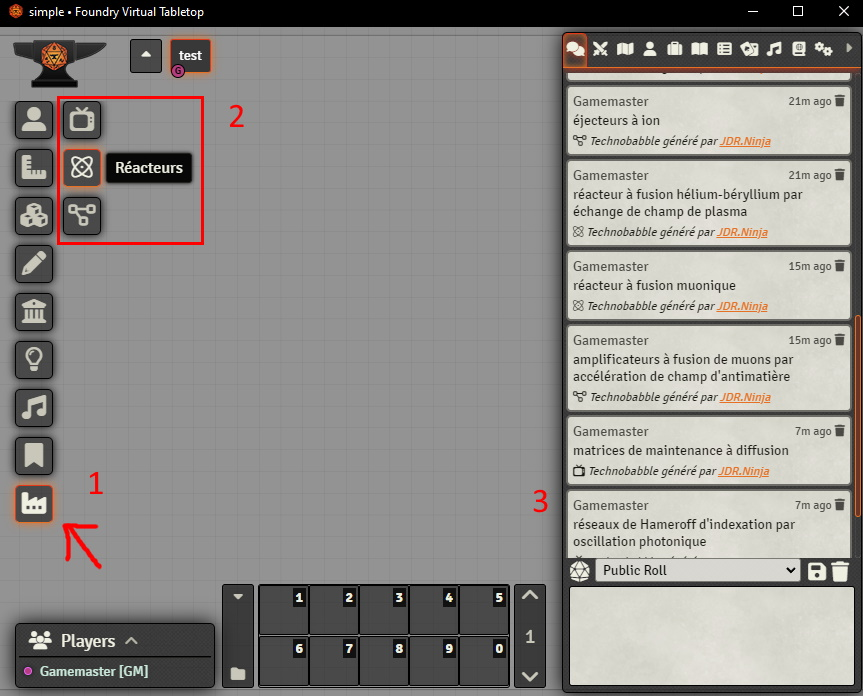

# JDR Ninja Technobabble

JDR Ninja Technobabble est un module pour FoundryVTT qui permet de générer du technobabble.

### Qu'est-ce que du Technobabble?
Le technobabble est un terme souvent utilisé dans les jeux de rôle de science-fiction pour décrire le langage ou la terminologie technique complexe et impressionnante utilisée pour décrire des concepts scientifiques imaginaires. Il s'agit d'un jargon pseudo-scientifique qui vise à donner une apparence de réalisme et de sophistication à des idées ou des technologies fictives.
